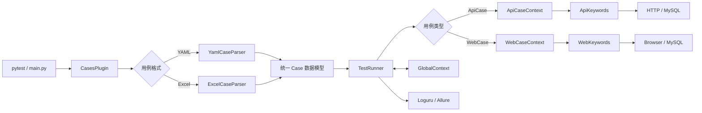

# HAT 自动化测试框架

HAT（Hybrid Automation Testing Framework）是一个基于 Python 与 pytest 构建的关键字驱动自动化测试框架。框架通过统一的用例模型同时支持 YAML 和 Excel 两种用例载体，并封装 API、Web UI、数据库校验、变量传递、数据驱动测试及 Allure 报告能力。

项目的设计目标是降低自动化用例的编写门槛：测试人员主要维护结构化测试数据，框架负责用例发现、格式解析、参数渲染、关键字调度、上下文管理和报告生成。

## 项目特点

- 支持 YAML、Excel 两种测试用例格式；
- 基于 pytest 插件完成用例发现与动态参数化；
- 支持 API 自动化和 Selenium Web UI 自动化；
- 支持 YAML 数据驱动测试（DDT），一个模板可展开为多个测试场景；
- 使用 Jinja2 实现跨步骤、跨用例的动态变量渲染；
- 支持 HTTP Session 和 WebDriver 会话复用；
- 支持 JSONPath 响应提取和数据库结果校验；
- 支持自定义关键字扩展；
- 集成 Loguru、tqdm 和 Allure，提供日志、进度、步骤及截图附件；
- API 与 Web 用例使用统一执行模型，便于继续扩展新的测试类型。

## 技术栈

| 分类 | 技术 |
|---|---|
| 编程语言 | Python 3 |
| 测试框架 | pytest |
| API 测试 | requests、jsonpath |
| Web 测试 | Selenium |
| 数据解析 | PyYAML、pandas |
| 数据库 | PyMySQL |
| 模板渲染 | Jinja2 |
| 日志与进度 | Loguru、tqdm |
| 测试报告 | Allure、allure-combine |

## 系统架构



框架的核心流程可以概括为：

```text
读取配置 → 解析用例 → pytest 参数化 → 初始化测试上下文
→ 渲染步骤变量 → 调用关键字 → 保存运行结果 → 生成 Allure 报告
```

## 项目结构

```text
.
├─ main.py                         # 项目运行入口与报告生成
├─ conftest.py                     # 注册 pytest 插件
├─ requirement.txt                 # Python 依赖
├─ HAT/
│  ├─ core/
│  │  ├─ cases_plugin.py           # pytest 参数与动态用例参数化
│  │  ├─ test_runner.py            # 测试用例执行器
│  │  └─ global_context.py         # 全局上下文管理
│  ├─ parse/
│  │  ├─ case_parser.py            # 解析器统一入口
│  │  ├─ yaml_case_parser.py       # YAML 用例解析与 DDT 展开
│  │  └─ excel_case_parser.py      # Excel 用例和配置解析
│  ├─ context/
│  │  ├─ api_case_context.py       # API Session 生命周期管理
│  │  └─ web_case_context.py       # WebDriver 生命周期管理
│  ├─ keywords/
│  │  ├─ api_keywords.py           # API、断言及数据库关键字
│  │  └─ web_keywords.py           # Web、断言及数据库关键字
│  ├─ extend/script/run_script.py  # 前置与后置脚本支持
│  ├─ key_dir/                     # 自定义关键字目录
│  └─ utils/
│     ├─ var_render.py             # Jinja2 变量渲染
│     └─ step_log_collector.py     # Allure 步骤日志收集
└─ examples/
   ├─ api_cases_yaml/              # API YAML 用例示例
   ├─ web_cases_yaml/              # Web YAML 用例与元素配置示例
   └─ api_cases_excel/             # Excel 用例与上下文示例
```

## 环境要求

- Python 3.10 或更高版本；
- Chrome、Firefox 等受支持浏览器；
- 对应浏览器驱动或 Selenium Grid；
- 如需生成 Allure HTML 报告，需要安装 Java 和 Allure Commandline。

## 安装

建议使用虚拟环境隔离项目依赖。

```powershell
python -m venv .venv
.\.venv\Scripts\Activate.ps1
python -m pip install --upgrade pip
python -m pip install -r requirement.txt
```

Linux 或 macOS：

```bash
python3 -m venv .venv
source .venv/bin/activate
python -m pip install --upgrade pip
python -m pip install -r requirement.txt
```

检查 Allure CLI：

```bash
allure --version
```

## 快速开始

### 运行 API YAML 用例

```powershell
python -m pytest -v -s `
  --alluredir=allure-results `
  --clean-alluredir `
  HAT/core/test_runner.py `
  --cases_type=yaml `
  --cases_path=examples/api_cases_yaml
```

### 运行 Web YAML 用例

运行前需要在 `examples/web_cases_yaml/context.yaml` 中配置测试环境、浏览器和驱动。

```powershell
python -m pytest -v -s `
  --alluredir=allure-results `
  --clean-alluredir `
  HAT/core/test_runner.py `
  --cases_type=yaml `
  --cases_path=examples/web_cases_yaml
```

### 运行 Excel API 用例

```powershell
python -m pytest -v -s `
  --alluredir=allure-results `
  --clean-alluredir `
  HAT/core/test_runner.py `
  --cases_type=excel `
  --cases_path=examples/api_cases_excel
```

### 通过主入口运行

`main.py` 中的 `get_pytest_args()` 集中定义默认用例类型、路径与 pytest 参数。完成目标环境配置后可执行：

```powershell
python main.py
```

### 生成并查看 Allure 报告

```powershell
allure generate allure-results -o allure-report --clean
allure open allure-report
```

也可以在测试结束后直接启动临时报告服务：

```powershell
allure serve allure-results
```

## YAML 用例规范

### 基础结构

```yaml
basic_configuration:
  case_type: "ApiCase"
  case_title: "login"
  module: "authentication"
  function: "login"

setup_script:
  - ""

teardown_script:
  - ""

case_steps:
  - send_login_request:
      request_method: "post_request"
      request_url: "{{url}}/api/login"
      request_parameters: ""
      request_headers:
        content-type: "application/json"
      request_payload:
        username: "{{username}}"
        password: "{{password}}"
      content_type: "json"
      file_path: ""

  - extract_token:
      request_method: "get_json_data"
      expression: "$..token"
      index: "0"
      variable_name: "token"

  - assert_login_result:
      request_method: "assert_text_equal"
      expected_value: "success"
      actual_value: "{{login_status}}"
```

### 基础配置字段

| 字段 | 说明 |
|---|---|
| `case_type` | 用例类型，目前支持 `ApiCase`、`WebCase` |
| `case_title` | 用例名称，同时用于 pytest ID 和 Allure 标题 |
| `module` | 所属模块，对应 Allure feature |
| `function` | 业务功能，对应 Allure story |

### 步骤字段

`case_steps` 是按顺序执行的步骤列表。每个步骤只有一个步骤名称，步骤内部通过 `request_method` 指定关键字，其余字段作为关键字参数传入。

```yaml
case_steps:
  - step_name:
      request_method: "keyword_name"
      parameter_a: "value"
      parameter_b: "{{context_variable}}"
```

### 数据驱动测试

使用 `ddt` 可以从同一用例模板展开多个场景：

```yaml
ddt:
  - scenario_title: "valid_user"
    username: "demo_user"
    password: "demo_password"
    expected_value: "success"

  - scenario_title: "invalid_password"
    username: "demo_user"
    password: "wrong_password"
    expected_value: "unauthorized"
```

解析后生成的用例名称为：

```text
login-valid_user
login-invalid_password
```

每条 DDT 数据会写入当前用例的 `local_context`，并在执行步骤前参与 Jinja2 变量渲染。

## 上下文配置

### YAML 上下文

每个 YAML 用例目录可以配置一个 `context.yaml`：

```yaml
url: "https://test.example.com"

session_reuse: true

key_dir: "./HAT/key_dir"

_database:
  test_database:
    host: "${DB_HOST}"
    port: 3306
    user: "${DB_USER}"
    password: "${DB_PASSWORD}"
    db: "test_db"
```

Web 用例还可以集中维护浏览器和元素定位信息：

```yaml
driver_reuse: true

_browser_config:
  grid_url: ""
  driver_path: "C:/tools/chromedriver.exe"
  capability:
    browser_name: "chrome"
  options:
    args:
      - "--incognito"

_all_web_elements:
  login:
    username_input:
      locating_method: "By.XPATH"
      expression: "//input[@name='username']"
    login_button:
      locating_method: "By.XPATH"
      expression: "//button[@type='submit']"
```

实际项目中建议通过环境变量、CI Secret 或密钥管理服务注入账号、密码和 Token，不在用例文件中保存真实凭据。

### Excel 上下文

Excel 用例目录使用 `context.xlsx`，包含以下工作表：

| 工作表 | 作用 |
|---|---|
| `general_configuration` | 通用键值配置，如 `case_type`、URL、复用开关 |
| `database_configuration` | 数据库别名、主机、端口、用户及数据库名 |

## Excel 用例规范

Excel 用例文件名需要以数字开头，例如：

```text
1_login_cases.xlsx
2_account_cases.xlsx
```

框架按照数字前缀升序加载文件。第一张工作表的核心列如下：

| 列名 | 说明 |
|---|---|
| `case_number` | 用例编号，可用于阅读和维护 |
| `module` | 业务模块 |
| `function` | 业务功能 |
| `case_title` | 用例标题；非空值表示新用例开始 |
| `step` | 步骤序号 |
| `case_steps` | 步骤名称 |
| `request_method` | 关键字名称 |
| `request_data` | JSON 格式的关键字参数 |
| `case_type` | `ApiCase` 或 `WebCase` |

同一用例的第一行填写基础信息，后续步骤行可以留空 `case_title`、`module`、`function` 和 `case_type`。解析器会将这些行归入最近一个用例。

`request_data` 示例：

```json
{
  "request_url": "{{url}}/api/account",
  "request_headers": {
    "authorization": "Bearer {{token}}"
  }
}
```

## 变量传递机制

框架通过 `GlobalContext` 保存运行期数据，并通过 Jinja2 在步骤执行前渲染变量。

典型数据链路：

```text
登录请求
  → response 写入上下文
  → JSONPath 提取 token
  → token 写入上下文
  → 后续请求使用 Bearer {{token}}
```

API 响应提取示例：

```yaml
- extract_token:
    request_method: "get_json_data"
    expression: "$..token"
    index: "0"
    variable_name: "token"
```

后续步骤引用：

```yaml
request_headers:
  authorization: "Bearer {{token}}"
```

## 内置关键字

### API 关键字

| 关键字 | 作用 |
|---|---|
| `send_request` | 发送通用 HTTP 请求 |
| `post_request` | 发送 POST 请求 |
| `get_request` | 发送 GET 请求 |
| `get_json_data` | 使用 JSONPath 提取响应数据 |
| `fetch_database_data` | 执行数据库查询并保存结果 |

### Web 关键字

| 关键字 | 作用 |
|---|---|
| `open_url` | 打开页面并截图 |
| `click_element` | 等待并点击元素 |
| `input_text` | 等待元素可见并输入文本 |
| `get_element_data` | 获取元素文本并写入上下文 |
| `maximize_window` | 最大化浏览器窗口 |
| `get_screenshot` | 将页面截图附加到 Allure |
| `quit` | 关闭 WebDriver |

### 断言关键字

| 关键字 | 作用 |
|---|---|
| `assert_text_equal` | 文本相等 |
| `assert_text_contain` | 文本包含 |
| `assert_text_not_contain` | 文本不包含 |
| `assert_number_ge` | 数值大于等于 |
| `assert_number_le` | 数值小于等于 |
| `assert_number_equal` | 数值相等 |
| `assert_number_not_equal` | 数值不相等 |
| `assert_number_gt` | 数值大于 |
| `assert_number_lt` | 数值小于 |

## 自定义关键字扩展

通过 `--key_dir` 或上下文中的 `key_dir` 指定扩展目录。框架按照以下约定查找关键字：

```text
请求方法：custom_login
模块文件：custom_login.py
类名：CustomLogin
实例方法：custom_login
```

示例：

```python
import allure


class CustomLogin:
    def __init__(self, client):
        self.client = client

    @allure.step("custom_login")
    def custom_login(self, **kwargs):
        # 在这里实现项目专属操作
        pass
```

调用方式：

```yaml
- custom_login_step:
    request_method: "custom_login"
    username: "{{username}}"
```

## 日志与测试报告

### 日志

`main.py` 使用 Loguru 同时输出控制台日志和文件日志：

```text
HAT/logs/YYYYMMDDHHMMSS.log
```

可通过环境变量控制文件日志级别：

```powershell
$env:HAT_LOG_LEVEL = "INFO"
python main.py
```

### Allure

框架为每条用例设置以下报告维度：

- `feature`：来自 `basic_configuration.module`；
- `story`：来自 `basic_configuration.function`；
- `title`：来自 `basic_configuration.case_title`；
- `step`：来自 `case_steps` 中的步骤名称；
- 附件：步骤日志、Web 页面截图。

## 核心设计思路

### 统一用例模型

YAML 和 Excel 解析器输出相同的 `case_info` 结构，执行器不需要关心用例来源。新增数据格式时，只需要增加解析器并注册到 `CASE_PARSERS`。

### 关键字驱动

用例通过 `request_method` 描述动作，执行器负责把名称映射到具体 Python 方法。测试数据与实现逻辑分离，便于非开发角色维护用例。

### 上下文驱动的数据链路

请求响应、JSONPath 提取结果和数据库结果都可以写入上下文，再由模板在后续步骤使用，适合描述登录、鉴权、查询和校验等连续业务流程。

### 生命周期复用

API Session 和 WebDriver 都支持按配置复用，在连续用例中减少连接或浏览器重复初始化的成本；框架同时注册了退出清理逻辑。

### pytest 插件化集成

用例解析发生在 pytest 收集阶段，动态生成测试参数和可读 ID，因此可以继续复用 pytest 的筛选、失败重跑、并行执行及报告生态。

## 工程能力

- 使用 pytest Hook 开发自定义用例收集和参数化插件；
- 设计多数据源到统一领域模型的解析层；
- 使用关键字驱动降低测试代码与测试数据的耦合；
- 使用 Jinja2 和上下文对象完成运行期变量传递；
- 管理 requests Session、Selenium WebDriver 等有状态资源；
- 设计 DDT 场景展开、用例命名和顺序加载策略；
- 集成数据库校验、日志、截图和 Allure 测试报告；
- 通过扩展目录为业务项目提供自定义关键字能力；
- 识别并持续优化状态隔离、敏感信息保护、异常传播和并行执行等工程问题。

## 使用建议

- 不要在仓库中提交真实账号、密码、Token 或数据库凭据；
- 不同环境使用独立配置，并通过环境变量或 CI Secret 注入敏感值；
- 用例文件和自定义关键字应来自可信来源；
- 外部服务测试与框架自身单元测试分层运行；
- Web 测试前确认浏览器、驱动版本及运行平台匹配；
- 开启并行执行前，确保用例之间没有隐式顺序依赖。
